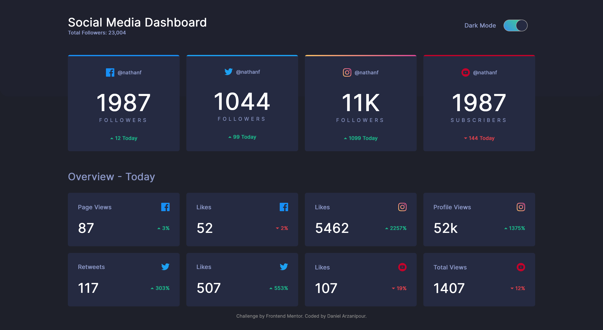
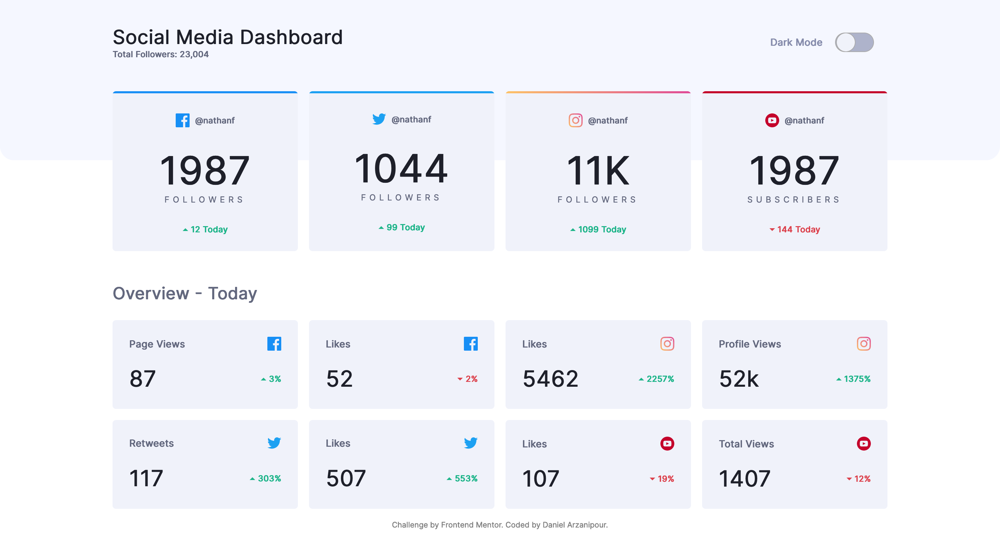

# Frontend Mentor - Social media dashboard with theme switcher solution

This is a solution to the [Social media dashboard with theme switcher challenge on Frontend Mentor](https://www.frontendmentor.io/challenges/social-media-dashboard-with-theme-switcher-6oY8ozp_H). Frontend Mentor challenges help you improve your coding skills by building realistic projects.

## The challenge

Users should be able to:

- View the optimal layout for the site depending on their device's screen size
- See hover states for all interactive elements on the page
- Toggle color theme to their preference

## Live Site

You can find the live version of the site [here](https://symphonious-peony-1b3bfe.netlify.app).

## Screenshot




## My Process

### Built With

- HTML
- SCSS
- Typescript
- Mobile First Workflow
- Fluid Type and Space Scales
- CUBE CSS Methodology
- NPM Scripts

### What I learned

- I learned the hard way that CSS drops the entire declaration including all of the rules that were grouped together along with it. I used the `:has` selector for my colour theme-ing and I grouped another class along with it that would act as my fallback but since firefox doesn't support the `:has` selector yet, it dropped the entire declaration, it took me some time to find out what my fallback wasn't working.

  - I ended up using the `is` selector along side it in order to fix this solution

  ```CSS
    /* What I had before */
    .dark, :root:has(#dark:checked)) {...}

    /* What I had after */
    :is(.dark, :root:has(#dark:checked)) {...}

  ```

- How to make the whole card clickable while keeping the semantics intact, I used a link inside the card with an absolutely positioned pseudo element off that link then I made the card position relative and gave the pseudo element a width and height of 100%.

- 3 ways on how to add a gradient as a border top (_which comes with the advantage of not having the strange curvature that would come with giving the border-top property of a box that has a border radius a colour_)

- How to create an accessible toggle switch, I had a choice between an on/off checkbox, a button element, or using 2 radio inputs, I went with the 2 radio inputs

- How to make store the users colour preference in localStorage so that the next time they visit the site, their preference will be remembered and the site will already be in that mode

## Continued Development

- I wrote the markup with the intention of coming back to this project and using an api to load data dynamically (_thus all the data attributes_)
- Perhaps by using the template element or through another way, loading these cards dynamically as well so that they don't clutter my html as they are now

## Resources

- [Theme Switcher](https://www.youtube.com/watch?v=fyuao3G-2qg) - The method of using the `has` selector came from here, only that the original Javascript as well as the css fallback had mistakes in it. I like this method and if I decide to use plain css for colour theme-ing, I may continue with this method

- Inclusive components by Heydon Pickering for understanding accessible toggle buttons

- [is selector](https://www.youtube.com/watch?v=McC4QkCvbaY) - An easy to understand explanation of the `is` selector as this was my first time using it

- [Accessible toggle using radio inputs](https://www.sarasoueidan.com/blog/toggle-switch-design/) ~ A blog about accessible toggles using radio inputs, it lead me to Scott O'hara's method of doing this and I decided to go with it

## Author

- [Portfolio Website](https://daniel-arzani-portfolio.netlify.app/)
- [Frontend Mentor Profile](https://www.frontendmentor.io/profile/DanielArzani)

## Acknowledgments

- The frontend mentor platform for the challenge and the design files

- The frontend mentor slack platform which is incredibly helpful for peer review, especially on the topics of accessibility and best practices
